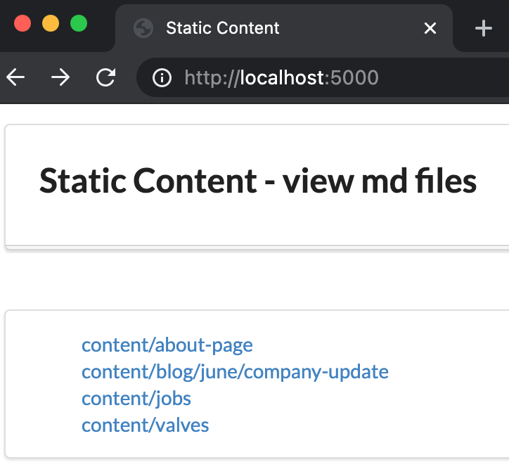

# express-static-content
> A node.js and express application that displays static content, utilises mocha &amp; chai testing

## Table of contents
* [General Info](#general-info)
* [Screenshots](#screenshots)
* [Technologies](#technologies)
* [Setup](#setup)
* [Code Example](#code-example)
* [Testing](#testing)
* [To-do list](#to-do-list)
* [Status](#status)
* [Contact](#contact)

## General Info

A node.js and express application that displays HTML pages at URLs that match the paths of the folders and sub-folders in the `content` folder. A template HTML is merged with md content.
Mocha & chai are utilised for testing.

## Screenshots


## Technologies
node.js & express

Testing:
bluebird
chai
chai-dom
jsdom
jsdom-global
mocha
supertest

## Setup

Use the following commands to run the development server:
* ```yarn start```

* To view in a browser: localhost:5000

* To run the tests:
```yarn test```

* To reseed the contents index (displayed in the above image):
```yarn seed```

## Code Example

Pass json list of md content to index.ejs
```js
app.get('/', (req, res) => {
  try {
    res.status(200).render('index.ejs', { mdFiles: mdJSONFiles })
  } catch (err) {
    res.status(404).render('404.ejs')
  }
})
```

## Testing
* Validates site '/' 200 HTTP status code
* site returns {}
* site returns '/random-url' 404 HTTP status code
* HTML generated from `index-test.html`
* HTML generated from `index.md`

## To-do list:
Schedule seed.js

## Status
Project is: _in progress_

## Contact
Created by [@teresaclark](https://github.com/tclark000/)